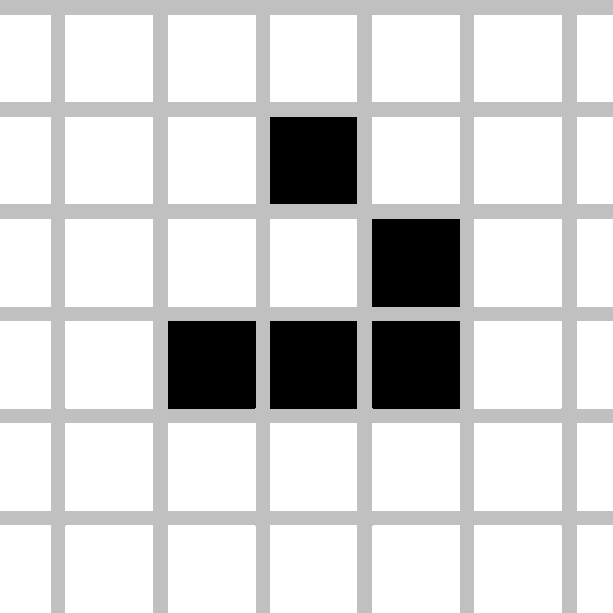

<h1 align="center">Game Of Life</h1>

  

<h2 align="center"><a  href="https://kazakovaolga.github.io/gameOfLife/">Live Demo</a></h2>

## Description

"The Game of Life" in Typescript as part of the OTUS JavaScript Developer course. Basic.

## Requirements

- implement the "Game of Life" application
- implement interaction with the field (clicking on a cell changes its state)
- implement hitchhiking of the game when all the cells have died
- implement a mechanism for changing the size of the field (two input fields (type number)), in pm on the fly (with an increase in the filling of dead cells, with a decrease in the destruction of cells)
- implement a mechanism game speed changes (input type=speed)
